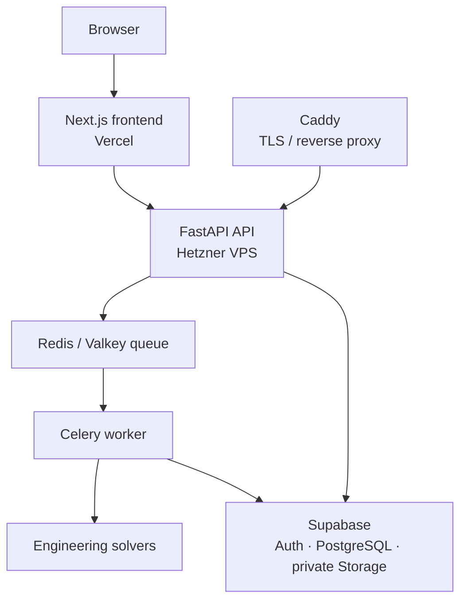

# ASRE-Lab

**Autonomous Smart Reverse Engineering Laboratory** — an engineering research platform that connects parametric design, bounded physics-based simulation, evidence capture, and reviewable engineering decisions.

[Live Platform](https://asre-lab.vercel.app) · [Production API](https://api.23-88-125-110.sslip.io) · [Technical Documentation](docs/) · [License](LICENSE)

ASRE-Lab is built for the point where an engineering question becomes a reproducible study. Instead of leaving design inputs, solver settings, results, evidence, and recommendations scattered across disconnected tools, it keeps them in one traceable workflow with explicit assumptions and boundaries.

## The Problem

Individual engineering researchers often move between parametric geometry, numerical tools, notebooks, spreadsheets, and ad-hoc reports. That makes it difficult to preserve what was simulated, why a model was considered valid, which evidence supports a conclusion, and how a later design iteration relates to earlier work.

ASRE-Lab brings those steps together without pretending that automation replaces engineering judgment.

## What I Built

The platform provides an authenticated workspace for creating supported parametric designs, choosing a bounded solver, checking inputs against declared validity rules, dispatching durable computation, and collecting the resulting evidence into decisions and reports.

```text
Research question
  → Parametric design
  → Physics-based evaluation
  → Evidence capture
  → Analysis and decision support
  → Reviewable iteration and report
```

Every stage is intentionally scoped to the models and data the implementation can actually support.

## What Happens During an Experiment?

1. A researcher describes a supported parametric design and stores the generated design record and private CAD artifacts.
2. They select a runnable solver, material, geometry, and boundary conditions from the registry-backed capability set.
3. The application evaluates declared validity rules before execution and blocks invalid configurations.
4. A sealed execution record dispatches the simulation to a separate worker. Progress, status, results, and field artifacts are retained as owner-scoped records.
5. The researcher reviews solver results, validity findings, benchmark and convergence inputs, then creates Scientific Trust evidence.
6. Evidence can inform deterministic analysis and a reviewable decision. A human records the decision before a research report is generated.

The workflow is designed to preserve context, not to turn a numerical result into an unreviewed engineering conclusion.

## Engineering Capabilities

ASRE-Lab ships bounded numerical models rather than a general-purpose industrial simulation suite.

| Family | Current implemented scope |
| --- | --- |
| Thermal conduction | Steady-state finite-difference conduction in bounded 1D and uniform cubic-grid scenarios. |
| Linear structural mechanics | 1D axial-bar and Euler–Bernoulli cantilever-beam analysis. |
| Modal analysis | SDOF mass-spring frequency and bounded 1D cantilever eigenvalue analysis. |
| Acoustics | Straight, lossless 1D plane-wave duct analysis. |
| Electrostatics | 2D rectangular-grid electrostatic potential and electric-field calculation. |
| Laminar flow | Bounded plane-Poiseuille channel-flow calculation for laminar regimes. |
| Thermal–structural workflow | Explicit one-way, sequential coupling for compatible bounded 1D cases. |

The solver registry is the authoritative capability source. These models do **not** claim arbitrary CAD-mesh simulation, general 3D FEA/CFD, turbulence, nonlinear plasticity, industrial certification, or bidirectional general multiphysics. The [scientific trust documentation](docs/SCIENTIFIC_TRUST.md) describes the supported domains and exclusions in more detail.

## Design Generation and Execution

Supported design requests become typed parametric records and can produce private STEP/STL artifacts through CadQuery/OCP. FastAPI owns the API boundary, validation, authorization, and persistence contracts. Redis/Valkey carries asynchronous work to a separate Celery worker, where engineering computation runs independently of the web request.

This separation makes execution status, retries, cancellation, and results observable without exposing private files or server paths to the browser.

## Engineering Intelligence, Evidence, and Scientific Trust

ASRE-Lab persists the context needed to inspect a result later: normalized inputs, solver identity and version, validity findings, convergence information, evidence records, artifacts, and provenance metadata. Where applicable, generated artifacts and field data are checksummed and linked to owner-scoped records.

The analysis layer provides deterministic descriptive statistics, associations, first-order sensitivity estimates, Pareto/trade-off views, transparent ranking, and evidence-linked recommendations. **Correlation indicates association; it does not establish physical causation.** Proposed design changes are hypotheses for review, not guaranteed improvements.

AI may assist with supported natural-language design interpretation and evidence-grounded explanation. It is not treated as physics validation, hidden evidence, autonomous approval, or a substitute for an engineer's review. Human action is required for engineering decisions.

For the underlying contracts, see [reproducible and reliable execution](docs/REPRODUCIBLE_RELIABLE_EXECUTION.md), [authentication and founding-user behavior](docs/AUTH_AND_FOUNDING_USERS.md), and the [frontend integration guide](docs/FRONTEND_INTEGRATION.md).

## Production Architecture



- **Frontend:** Next.js on Vercel.
- **Backend compute:** FastAPI, a separate Celery worker, persistent Redis/Valkey, and Caddy on a Hetzner VPS.
- **Data and identity:** Supabase Auth, PostgreSQL, and private Storage.
- **Transport security:** Caddy terminates TLS for the production API.
- **Source control and CI:** GitHub.

The current production services are available at [asre-lab.vercel.app](https://asre-lab.vercel.app) and [api.23-88-125-110.sslip.io](https://api.23-88-125-110.sslip.io). Browser-visible configuration contains only the API and Supabase public coordinates; backend service credentials remain server-side.

## Reliability and Validation

The repository includes unit, integration, benchmark, API-contract, migration, browser, and real-service validation. The production path has been exercised with Supabase authentication, owner isolation, private artifact access, a separate Redis/Celery worker, HTTPS, report export, and browser-based workflow checks.

Validation evidence is deliberately kept closer to the code and operational documentation rather than reproduced as a large status table here. Useful starting points:

- [Production configuration](docs/PRODUCTION_CONFIGURATION.md)
- [Frontend testing](docs/FRONTEND_TESTING.md)
- [Scientific trust](docs/SCIENTIFIC_TRUST.md)
- [Reproducible and reliable execution](docs/REPRODUCIBLE_RELIABLE_EXECUTION.md)

Tracked Supabase migrations are maintained through **013** in `backend/supabase/migrations/`.

## Current Scope and Limitations

ASRE-Lab is intentionally precise about its boundaries:

- Solvers run only within their declared geometry, material, boundary-condition, and validity envelopes.
- It is not arbitrary industrial 3D multiphysics, arbitrary-mesh FEA/CFD, or a certification tool.
- Some models are steady, linear, one-dimensional, or regular-grid by design; their outputs must be interpreted in that context.
- Recommendations, rankings, and proposals remain reviewable decision support. They do not establish causality or replace engineering responsibility.
- Reproducibility depends on retaining compatible inputs, solver versions, and physical-model assumptions; incompatible cases are reported rather than silently compared.

## Repository Structure

| Path | Purpose |
| --- | --- |
| `frontend/` | Next.js product interface, Supabase browser session handling, and Playwright coverage. |
| `backend/` | FastAPI services, solver registry, Celery tasks, persistence adapters, tests, and Supabase migration mirror. |
| `database/` | SQL schema and migration assets used by the project. |
| `docs/` | Scientific scope, architecture, reliability, product integration, and operational references. |
| `deploy/` | Caddy and VPS deployment assets; no credentials are committed. |
| `docker-compose.vps.yml` | Single-VPS production-style topology for API, worker, Redis, frontend, and Caddy. |

## Running Locally

ASRE-Lab can run locally with the repository's Docker Compose configuration or with the frontend, API, worker, Redis, and a Supabase-compatible environment configured separately. Start with [production configuration](docs/PRODUCTION_CONFIGURATION.md) for required environment-variable names and service boundaries, then use the relevant frontend and backend test documentation for development workflows.

Never commit credentials. The public frontend uses only `NEXT_PUBLIC_*` browser-safe settings; service-role and worker configuration belong on the backend only.

## Live Project

**Platform:** [https://asre-lab.vercel.app](https://asre-lab.vercel.app)
**API:** [https://api.23-88-125-110.sslip.io](https://api.23-88-125-110.sslip.io)

## License

ASRE-Lab is **proprietary, source-available software**. Public visibility permits technical inspection only; it does not grant permission to use, copy, modify, redistribute, deploy, train AI systems on, or create derivative works from the project. See [LICENSE](LICENSE) for the full terms.
