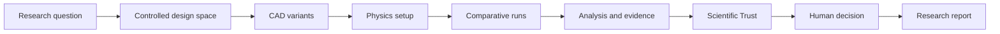
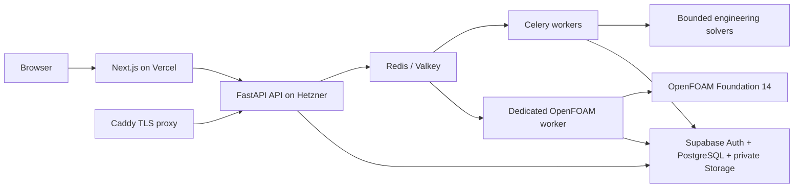

# ASRE-Lab

**Autonomous Smart Reverse Engineering Laboratory**

ASRE-Lab is an engineering research platform for controlled design comparison. It creates parametric alternatives, runs supported physical models, stores the results and scientific evidence, compares designs, and keeps the final human decision connected to the data that produced it.

Built by **Eslam M Badawi** in 2026.

[Live platform](https://asre-lab.vercel.app) · [Research quickstart](REAL_RESEARCH_QUICKSTART.md) · [Documentation](docs/README.md) · [Scientific scope](docs/SCIENTIFIC_SCOPE.md) · [License](LICENSE)

## Why I built it

The project started while I was working on a research idea about the engineering characteristics of the Giza pyramids.

My focus was the geometry itself. The question was simple: if a structure was intended to perform well for a physical purpose, what geometry would work best and how close would the real structure be to that geometry?

Testing many accurate physical models was not practical. That led to the main idea behind ASRE-Lab: create controlled digital alternatives, run the same physical model on each one, and compare the results.

The important part is the comparison. One design gives one result. A controlled design space can show which parameters matter, which changes improve or worsen a result, and where trade-offs appear.

## Core idea

I call the approach **reverse engineering by contrast**.

The original geometry is treated as a reference. The system creates controlled alternatives around it. The alternatives are tested under the same declared physical and numerical conditions. The results are then compared.

This does not prove why an original designer made a certain choice. It shows measurable relationships between design changes and physical behavior.

```mermaid
flowchart LR
    Q[Research question] --> D[Controlled design space]
    D --> C[CAD variants]
    C --> P[Physics setup]
    P --> R[Comparative runs]
    R --> A[Analysis and evidence]
    A --> T[Scientific Trust]
    T --> H[Human decision]
    H --> O[Research report]
```

## What the product does

The current product has a public landing page, authentication, a persisted research dashboard, and a guided study workspace.

A study moves through eight visible stages:

1. **Question**
   Define the research question, hypothesis, and study context.

2. **Design**
   Resolve structured parameters, create a design space, generate controlled variants, and persist CAD artifacts.

3. **Physics**
   Choose a supported model and define material, boundary conditions, and numerical settings.

4. **Validation**
   Review what varies, what stays constant, model assumptions, settings, and scientific limits before execution.

5. **Run**
   Start durable simulations, monitor progress, inspect partial failures, and keep completed results.

6. **Evidence**
   Review results, analysis, numerical evidence, field evidence, validity information, and convergence information.

7. **Decision**
   Build an evidence-grounded decision basis and require an explicit human action.

8. **Report**
   Generate a persisted research summary and export PDF, JSON, or CSV.

The workspace can be reopened after refresh or sign-in. Study state is stored on the server rather than being treated as temporary browser state.

See [Product workflow](docs/PRODUCT_WORKFLOW.md) for the frontend and user journey.

## Frontend

The frontend is a Next.js application deployed on Vercel.

The main goal of the interface is to make the research state readable without hiding the technical details. Human labels such as `Design 01` are used for navigation while UUIDs remain available for traceability. The pre-run view separates variables from controlled conditions. Results keep the design, simulation, solver, units, convergence state, evidence, decision, and report connected.

The UI also handles persisted study recovery, async job polling, authenticated downloads, validation errors, safe backend errors, and cross-study state isolation.

The main guided v1 workflow currently focuses on the controlled square-pyramid thermal study. The backend has a broader solver registry for other bounded research models.

## Engineering and scientific scope

ASRE-Lab does not treat every simulation request as valid. Each solver has a declared capability entry with supported geometry, equations, numerical method, required inputs, outputs, known limits, and validation status.

The current codebase includes bounded capabilities across:

- steady thermal conduction
- geometry-aware square-pyramid thermal conduction
- 1D linear structural mechanics
- 1D modal analysis
- 1D duct acoustics
- 2D electrostatics
- 2D laminar channel flow
- CAD-derived 3D thermal FEM
- CAD-derived 3D linear elasticity FEM
- CAD-derived 3D modal FEM
- CAD-derived 3D acoustic Helmholtz FEM
- CAD-derived 3D laminar internal-flow CFD with OpenFOAM
- one-way thermal to structural coupling

The 3D CAD-mesh and OpenFOAM capabilities are intentionally bounded and partially validated. They are not presented as general industrial FEA or CFD.

The solver registry in `backend/app/module2_simulation/solver_registry.py` is the technical source of truth.

See [Scientific scope](docs/SCIENTIFIC_SCOPE.md) and [Scientific Trust](docs/SCIENTIFIC_TRUST.md).

## Evidence and Scientific Trust

A numerical result is not treated as a scientific conclusion by itself.

ASRE-Lab keeps traceable records around the result, including:

- normalized inputs
- design and simulation identity
- solver and version
- validity findings
- scalar numerical results
- field artifacts where supported
- run convergence
- benchmark evidence where applicable
- refinement evidence where applicable
- analysis provenance
- warnings and limitations

Scientific Trust is a classification based on persisted evidence. It is not an AI confidence score.

Iterative solver convergence is not the same as spatial refinement. A benchmark that was not run remains `NOT_RUN`. Missing evidence is not invented to make a result look stronger.

AI can help interpret supported inputs or explain existing evidence. It is not used as a physics solver and it is not allowed to create physical evidence.

A human action is required before a decision is treated as accepted, rejected, or sent back for modification.

## Example study

The main production study used a square pyramid with a fixed 2 m by 2 m base and concrete material. Height was varied across five controlled designs while the solver, material, boundary conditions, and numerical settings were held constant.

The workflow produced:

- five persisted design variants
- CAD artifacts
- five persisted thermal simulations
- numerical and field evidence
- iterative convergence records
- a persisted comparative analysis
- a human-reviewed decision
- a generated report

The point of the example is not the pyramid itself. It shows the full chain from a controlled design question to a traceable decision.

## Architecture

```mermaid
flowchart LR
    B[Browser] --> F[Next.js on Vercel]
    F --> A[FastAPI API on Hetzner]
    A --> Q[Redis / Valkey]
    Q --> W[Celery workers]
    Q --> C[Dedicated OpenFOAM worker]
    W --> S[Bounded engineering solvers]
    C --> OF[OpenFOAM Foundation 14]
    A --> DB[Supabase Auth + PostgreSQL + private Storage]
    W --> DB
    C --> DB
    X[Caddy TLS proxy] --> A
```

Main runtime parts:

- **Frontend**: Next.js and React on Vercel
- **API**: FastAPI
- **Async execution**: Redis or Valkey and Celery
- **Engineering compute**: Python numerical solvers and a dedicated OpenFOAM worker for the bounded 3D CFD path
- **Data**: Supabase Auth, PostgreSQL, and private object storage
- **TLS and reverse proxy**: Caddy
- **Infrastructure**: Hetzner VPS and Docker Compose
- **Source and CI**: GitHub

See [Architecture](docs/ARCHITECTURE.md).

## Testing and release state

The project uses unit tests, integration tests, scientific benchmark tests, API tests, frontend behavior tests, type checking, production builds, and browser-based QA.

The latest code-level release audit found and fixed issues in Evidence transport handling, comparative job status accounting, stale frontend responses, download error handling, and failure logging. After the final code patch there were no known P0, P1, or material P2 engineering defects.

The final live human browser acceptance pass completed successfully against the production workflow with **no release blockers**. The tested v1 code baseline is:

`f5558ede291810f32040c856ff78eab0efd77c1d`

The application code is frozen at that baseline for v1. New product work belongs in a later version rather than changing the accepted v1 implementation.

See [Validation and release](docs/VALIDATION_AND_RELEASE.md) for the exact status and verification gaps.

## What ASRE-Lab does not claim

ASRE-Lab is not:

- a general industrial FEA suite
- a general CFD package
- an unrestricted multiphysics platform
- a certification or safety approval tool
- a replacement for engineering judgment
- a system that turns correlation into causation
- a system that lets AI create scientific evidence

Every result must be read inside the limits of the model that produced it.

## Repository structure

| Path | Purpose |
| --- | --- |
| `frontend/` | Next.js product interface, authentication flow, research workspace, downloads, and frontend tests |
| `backend/` | FastAPI services, solver registry, numerical solvers, evidence, analysis, workers, and backend tests |
| `database/` | SQL schema and database migration assets |
| `docs/` | Product, scientific, architecture, testing, integration, and operations documentation |
| `deploy/` | Caddy and VPS deployment configuration |
| `docker-compose*.yml` | Local, staging, and VPS service topology |

## Documentation

Start with [docs/README.md](docs/README.md).

Main project documents:

- [Project overview](docs/PROJECT_OVERVIEW.md)
- [Product workflow and frontend](docs/PRODUCT_WORKFLOW.md)
- [Scientific scope](docs/SCIENTIFIC_SCOPE.md)
- [Architecture](docs/ARCHITECTURE.md)
- [Validation and release](docs/VALIDATION_AND_RELEASE.md)
- [Real research quickstart](REAL_RESEARCH_QUICKSTART.md)
- [Scientific Trust](docs/SCIENTIFIC_TRUST.md)
- [Reproducible execution](docs/REPRODUCIBLE_RELIABLE_EXECUTION.md)

## Live project

**Platform**
https://asre-lab.vercel.app

**Production API**
https://api.23-88-125-110.sslip.io

## License

ASRE-Lab is proprietary source-available software. Public access allows technical inspection but does not grant permission to copy, modify, redistribute, deploy, train AI systems on, or create derivative works from the project.

See [LICENSE](LICENSE).
