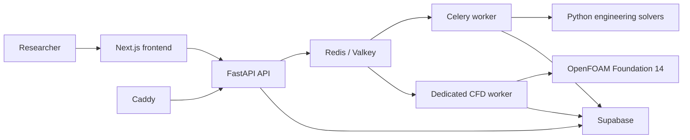

# Architecture

## Overview

ASRE-Lab separates the browser, API, async execution, numerical compute, and persistent data.



## Frontend

Location:

`frontend/`

Main responsibilities:

- landing and scientific-scope pages
- Supabase browser session
- dashboard
- Study creation and reopen
- guided research workspace
- job polling
- results and evidence presentation
- Scientific Trust presentation
- human decision flow
- report and artifact downloads
- readable error handling

The production frontend runs on Vercel.

Protected API requests are sent through the frontend proxy and include the current Supabase bearer token.

## API

Location:

`backend/app/`

The FastAPI service owns:

- authentication checks
- owner scoping
- Study persistence
- design and CAD orchestration
- simulation creation
- capability validation
- Evidence APIs
- analysis APIs
- Scientific Trust
- decisions
- reports
- export endpoints

The API runs on a Hetzner VPS behind Caddy.

## Design module

The design layer turns supported input into structured parameters and persisted design records.

Supported geometry generation uses CadQuery and OCP.

Artifacts can include:

- STEP
- STL
- authoritative CAD-derived mesh data for supported 3D paths

Design artifacts stay linked to the Study that created them.

## Simulation module

The simulation layer has two important responsibilities.

First, the solver registry defines what each model can and cannot do.

Second, long-running engineering work is separated from the web request.

The API creates durable jobs and sends them to the queue. Workers execute the calculation and persist the result.

This avoids keeping the browser request open during numerical work.

## Async execution

Redis or Valkey is used as the queue and broker layer.

Celery workers execute durable background tasks.

The production topology includes a separate CFD worker for the bounded OpenFOAM path.

Job records preserve:

- status
- progress
- completed and failed counts
- safe error metadata
- persisted result identity

Partial failure is kept distinct from full success.

## Numerical compute

The codebase contains more than one numerical execution family.

### Bounded structured models

These include 1D and structured-grid thermal, structural, modal, acoustic, electrostatic, and channel-flow cases.

### Parametric pyramid model

The square-pyramid thermal solver builds a Cartesian masked domain from the stored dimensions.

It does not consume the STEP or STL as a numerical mesh.

### CAD-derived 3D FEM

Supported 3D thermal, structural, modal, and acoustic paths consume authoritative CAD-derived TET4 mesh data and an explicit physics model.

### CAD-derived 3D CFD

The bounded OpenFOAM path uses a certified CAD-derived finite-volume mesh and a dedicated worker.

## Analysis

The analysis layer converts a set of persisted simulations into one experiment dataset.

It can compute:

- descriptive statistics
- associations
- first-order standardized regression sensitivity
- Pareto results
- deterministic ranking
- evidence-linked recommendations

Analysis records keep their source simulation IDs and dataset hash.

A later analysis does not need to replace an earlier persisted analysis.

## Evidence and Scientific Trust

Evidence records connect scientific claims to the persisted simulation state.

Scientific Trust uses those records to summarize the current validation position.

The design rule is:

```text
No scientific claim without traceable evidence
```

The AI layer can interpret evidence but does not create physical evidence.

## Human decision and report

A decision is a persisted record that includes the evidence context used for review.

The system requires an explicit human action.

A report is generated after that decision context exists.

Exports are owner-scoped and authenticated.

## Data and storage

Supabase provides:

- authentication
- PostgreSQL persistence
- private object storage

Relationships are maintained between:

```text
user
-> Study
-> design
-> simulation
-> result and fields
-> evidence
-> analysis
-> Scientific Trust
-> decision
-> report
```

Private artifacts are stored under owner-scoped paths.

The browser does not receive backend service credentials or private host paths.

## Deployment

Production components:

| Component | Runtime |
| --- | --- |
| Frontend | Vercel |
| API | Hetzner VPS |
| Reverse proxy and TLS | Caddy |
| Queue | Redis or Valkey |
| Standard async compute | Celery worker |
| Bounded 3D CFD | Dedicated OpenFOAM worker |
| Auth and persistence | Supabase |
| Source and CI | GitHub |

The repository contains Docker Compose configurations for local, staging, and VPS-style deployment.

See [Production configuration](PRODUCTION_CONFIGURATION.md) for environment and service details.
