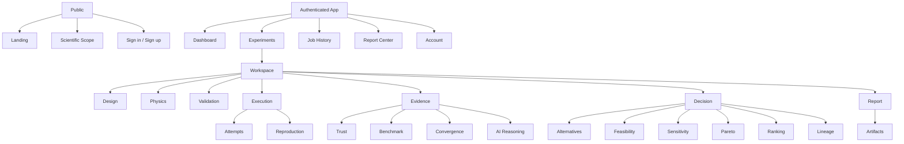

# ASRE-Lab Frontend Product and Integration Dossier

**Product name:** ASRE-Lab — Autonomous Smart Reverse Engineering Laboratory

**Backend baseline:** `origin/main` at `bf51ef981e0c86c34d82026f24770a79a28f38b0`

**Frozen contract:** `backend/openapi-contract.json`, 82 paths, SHA-256 `80e283bf5fa9b1ba74de7141abf3fa1047181b2f48ff115f09c1388d3bcd379d`

**Audience:** product design, Google Stitch, frontend engineering, integration testing, and deployment planning

This document describes only capabilities verified in the merged repository and live
FastAPI OpenAPI document. It separates product design intent from current API
limitations so that the frontend does not fabricate functionality.

## 1. Product Definition

ASRE-Lab is a bounded engineering research environment for generating parametric
design alternatives, running supported numerical models, preserving scientific
evidence, comparing alternatives, and producing reviewable decisions and research
outputs. It addresses a common prototype-stage problem: geometry, simulation inputs,
solver assumptions, numerical checks, decisions, and artifacts are often scattered
across unrelated tools and cannot be reconstructed later.

The product is suitable for engineering students, researchers, technical educators,
prototype designers, and early-stage engineering teams. It supports exploratory and
research-grade traceability inside declared model limits. It is not industrial
certification, regulatory approval, safety assurance, production CAD/PDM, general
purpose FEA/CFD, or a substitute for a qualified engineer.

### Verified scientific scope

| Solver | Status | Bounded scope | Principal exclusions |
|---|---|---|---|
| `thermal_conduction_v1` | Real, validated | Steady 1D rod/slab and uniform cubic 3D finite differences | No transient conduction, convection boundary, or arbitrary CAD mesh |
| `structural_linear_1d_v1` | Real, validated | Straight 1D axial bar or Euler–Bernoulli cantilever beam | No plates, shells, 3D solids, plasticity, buckling, or arbitrary supports |
| `modal_eigen_1d_v1` | Real, validated | SDOF mass-spring or straight cantilever beam modes | No damping or arbitrary 3D modal analysis |
| `acoustic_duct_1d_v1` | Real, validated | Uniform straight lossless duct, plane waves | No rooms, losses, transverse modes, or nonlinear acoustics |
| `electrostatic_rectangular_2d_v1` | Real, validated | Uniform rectangular electrostatic grid | No magnetics, time dependence, dielectric interfaces, or arbitrary geometry |
| `cfd_laminar_channel_2d_v1` | Real, validated | Steady, fully developed plane-Poiseuille flow, `Re < 2000` | No turbulence, compressibility, obstacles, inlet development, or external flow |
| `thermal_structural_one_way_v1` | Trust capability and coupling workflow | Sequential steady thermal to restrained linear structural response | One-way only; no deformation feedback |
| `coupled_multiphysics_v0` | Planned, unavailable | Registry placeholder only | Must never be offered as runnable |

Scientific Trust provides solver metadata, assumptions, validity-envelope findings,
analytical benchmark comparison, three-level convergence evidence where applicable,
warnings, limitations, evidence references, and confidence (`high`, `moderate`, `low`,
or `invalid`). Reproducible Execution provides normalized manifests, stable checksums,
sealing, cloning, attempts, checkpoints, retry/resume, reproduction, comparison, and a
private ZIP bundle record. Decision Support provides bounded Latin hypercube sampling,
objective and constraint validation, feasibility, sensitivity, Pareto membership,
deterministic weighted ranking, and human actions. AI Reasoning provides evidence
summaries at Simple, Engineering, and Research levels; it explicitly does not expose
hidden chain-of-thought. Research Reports produce private PDF, JSON, and CSV artifacts.

The backend does not claim topology optimization, arbitrary reverse engineering from
scans, collaborative editing, public sharing, industrial certification, general
multiphysics, general CAD editing, or autonomous approval.

## 2. Complete User Journey

The ideal journey uses a combined guided setup and persistent experiment workspace.
Items marked **API gap** require a future backend route before production enablement.

| Step | Intent and input | Backend action and visible result | Warnings, empty/failure, next action |
|---|---|---|---|
| 1. Landing | Understand scope | Public product and scientific-scope content; optionally call `GET /health` and `GET /version` | If unavailable, show service status without blocking product information |
| 2. Sign up/sign in | Create or access an account | Supabase Auth in the browser; send the access token as `Authorization: Bearer` | Expired/invalid token returns 401; reauthenticate. FastAPI exposes no signup or token endpoint |
| 3. Dashboard | Resume useful work | Show locally known/recent resource identifiers and active jobs | **API gap:** no owner-scoped collection endpoints for experiments, V2 runs, reports, or decisions; do not fabricate a complete server-derived dashboard |
| 4. Create experiment | Establish a research unit | Design generation, simulation, and V2 evidence accept `experiment_id` | **API gap:** no standalone experiment CRUD route. The client may use a UUID, but durable discovery is unavailable |
| 5. Define geometry | Enter dimension and bounded parameters | Validate typed simulation geometry or design-generation payload | Show units and solver-specific required fields; reject unsupported dimensions |
| 6. Select material | Choose registry-supported material | `GET /api/simulations/capabilities` supplies allowed materials | No custom material creation API |
| 7. Boundary conditions | Define physical loading | Typed boundary-condition fields are validated by the selected solver | Hide irrelevant fields, but never silently default a required condition |
| 8. Select simulation | Choose a real solver | Capabilities and recommendation routes identify available versus planned solvers | Planned/unsupported choices are read-only and cannot start a run |
| 9. Review assumptions | Confirm model validity | `GET /api/v2/scientific/solvers/{solver_id}` and `POST .../validate` | Errors block execution; boundary warnings require acknowledgement |
| 10. Define objectives | Select metric, direction, weight, unit | `POST /api/v2/decisions/objectives/validate` | At least one enabled objective; unsupported metric/unit or negative weight is invalid |
| 11. Define constraints | Set operator and limit | `POST /api/v2/decisions/constraints/validate` | Unsupported metric/operator/unit is invalid |
| 12. Add alternatives | Generate designs or DOE samples | Design routes or `POST /api/v2/decisions/doe` | DOE is bounded to 1–25 samples; generated samples are not automatically run |
| 13. Pre-run explanation | Understand what will happen | Create reasoning with stage `workflow_planned` or `validity_check_completed` | If evidence is missing, say: “There is not enough evidence to explain this result confidently.” |
| 14. Start run | Seal and dispatch supported simulation | `POST /api/v2/execution/runs` with an idempotency key, or create/seal manifest and attempt explicitly | 409 describes invalid transitions/resource limits; never auto-retry non-idempotently |
| 15. Monitor | Track durable work | Poll simulation/job status and V2 attempt/history endpoints | Show queue/stage, attempt, progress, heartbeat, warnings, and safe error; API does not provide push events |
| 16. Inspect results | Understand numerical output | Simulation results, fields, and batch results routes | Result types differ by solver; partial failure must stay visible |
| 17. Scientific Trust | Judge bounded confidence | Create/retrieve trust evidence | Confidence is not a pass/fail badge alone; show reasons and blockers |
| 18. Benchmark/convergence | Inspect numerical evidence | Benchmark and convergence operations | Benchmark uses a bounded analytical case. Convergence requires exactly coarse, medium, and fine values; coupling may be not applicable |
| 19–23. Compare and rank | Evaluate alternatives | Feasibility, sensitivity, analyse, and manifest compare operations | Correlation is not causation; Pareto visualization is strongest for two selected objectives |
| 24. Recommendation | Review deterministic support | Persist decision via `POST /api/v2/decisions` | State that ranking depends on evidence, objectives, constraints, and weights |
| 25. Approve | Accept, reject, or request modification | `POST /api/v2/decisions/{id}/actions` | Human action is required; action becomes non-actionable after the first transition |
| 26. Next iteration | Continue from approved design | Accepted decision returns lineage identifiers; legacy design-feedback routes can create/accept/execute proposals | Do not imply automatic geometry creation from V2 decision alone |
| 27. Lineage | Trace parent/child evidence | Decision lineage, manifest parent/original IDs, and design-feedback iterations | No consolidated graph endpoint; assemble only from retrieved records |
| 28. Reproduce | Re-run sealed evidence | `POST .../manifests/{manifest_id}/reproduce` with idempotency key | Requires persisted simulation inputs |
| 29. Compare reproduction | Quantify differences | `POST .../manifests/{manifest_id}/compare` | May return `not_comparable`; show reason codes and tolerances |
| 30. Bundle | Generate reproducibility archive | `POST .../manifests/{manifest_id}/bundle` | **API gap:** bundle metadata is returned, but no authenticated bundle-download endpoint exists |
| 31. Report | Assemble selected evidence | `POST /api/v2/reports` | All evidence IDs must exist and belong to the user |
| 32. Export | Download available formats | Report PDF/JSON/CSV; NPZ field download; legacy STL download | STEP and ZIP may exist in inventories but lack generic download routes. Do not render active buttons without a route |
| 33. Return later | Reconstruct experiment | Retrieve known IDs through owner-scoped detail endpoints | **API gap:** no experiment or V2 collection listing; full discovery requires a future owner-scoped index |

## 3. Information Architecture

Use a shallow application shell. Global navigation holds cross-experiment functions;
the experiment workspace holds the engineering sequence.

Global navigation: Dashboard, Experiments, Jobs, Reports, Scientific Scope, Account.
Experiment navigation: Overview, Design, Physics, Validation, Runs, Results, Evidence,
Decision, Lineage, Reports. Run navigation: Summary, Progress, Results, Trust,
Artifacts, Attempts, Reproduction. “Projects” should not be a separate backend entity
until project CRUD exists.

## 4. Page-by-Page Specification

Every authenticated page sends the bearer token, maps 401 to reauthentication, maps
owner-hidden resources to a neutral not-found state, and preserves technical warnings.

| Page / suggested route | Objective and layout | Exact content and actions | API dependencies | Required states and responsive behavior |
|---|---|---|---|---|
| Landing `/` | Public overview with restrained hero, workflow, scope, evidence, CTA | Product definition, seven-stage flow, supported families, limitations, sign-in | Optional `/health`, `/version` | Service warning; single column on mobile |
| Capabilities `/capabilities` | Searchable solver matrix | Status, version, equations, dimensions, materials, boundaries, metrics, limitations | `GET /api/simulations/capabilities`; V2 solver metadata | Skeleton, no-capabilities failure; cards become stacked rows |
| Scientific Scope `/scientific-scope` | Explain bounded models | Assumptions, validity limits, benchmark metadata, exclusions | V2 scientific solver list/detail | Planned capabilities visibly unavailable |
| Sign in/up `/auth/*` | Supabase Auth form | Email/password or configured provider, password recovery if Supabase enables it | Supabase Auth, not FastAPI | Validation, expired link, offline, session-loading |
| Dashboard `/app` | Action-oriented home | Active known jobs, recent known runs/reports/recommendations, warnings, quick create | Detail/status routes for client-known IDs | Prominent API-gap empty state; never show invented aggregate counts |
| Experiments `/app/experiments` | Resume experiments | Locally known experiment IDs and links | **API gap:** no server list/create endpoint | Explain limited discovery; no fake list |
| Create experiment `/app/experiments/new` | Guided setup | Client-generated experiment ID, title held in workflow state, design/physics setup | Downstream create routes | Warn that standalone experiment persistence/listing is unavailable |
| Overview `/app/experiments/:id` | Stage summary | Completion blockers, runs, evidence IDs, decision/report links known to client | Multiple known-ID detail calls | Partial-data and stale-ID states |
| Design `/.../design` | Parametric alternatives | Geometry family/parameters, prompt parse, single/matrix/batch generation, artifact metadata | `/api/design/parse`, `/generate-single`, `/generate-matrix`, `/generate-batch` | Generate progress, validation, partial batch failure |
| Physics `/.../physics` | Material, geometry, boundary, solver form | Solver-dependent fields and registry limitations | capabilities, recommend, solver detail/validate | Block unsupported solver; technical help accordion |
| Validation `/.../validation` | Scientific pre-check | Validity card, findings, benchmark form/table, convergence chart | V2 validate/benchmark/convergence/trust | Invalid blocks; warnings remain expanded |
| Objectives `/.../objectives` | Define decision model | Objective rows: metric, direction, weight, unit, enabled | objective validation | Weight and unit errors inline |
| Constraints `/.../constraints` | Define acceptance limits | Metric, operator, value/range, tolerance, unit, required confidence | constraint validation | Empty constraints allowed; malformed rows block |
| Alternatives `/.../alternatives` | Manage bounded alternatives | Design table, DOE setup and samples, evidence completeness | DOE, design routes | 25-sample limit and unsimulated sample state |
| Run monitor `/.../runs/:runId` | Durable operational view | Status header, progress, stage timeline, attempt number, heartbeat, warnings, cancel/retry/resume | simulation/job status plus V2 manifest/attempt/history | Polling, stale heartbeat, worker unavailable, restart reconstruction |
| Results `/.../runs/:runId/results` | Solver-specific outcome | Metric cards with units, convergence, warnings, field inventory, geometry/artifacts | simulation results/fields; batch results | Partial failure and no-field states |
| Scientific Trust `/.../trust` | Evidence judgment | Confidence, physical model, solver/version, findings, benchmark, convergence, limitations | solver detail and trust record | Confidence text/icon; invalid is not merely red |
| Benchmark `/.../benchmark` | Analytical comparison | Reference type/inputs/result, computed result, absolute/relative error, tolerance, pass status | benchmark operation | Missing required inputs and failed tolerance |
| Convergence `/.../convergence` | Resolution evidence | Coarse/medium/fine values/configurations, changes, threshold, recommended level | convergence operation | Not applicable, not converged, incomplete exactly-three-level input |
| Comparison `/.../compare` | Compare runs/designs | Metric difference/tolerance table, model compatibility, checksum equivalence | manifest compare; decision analyse | `not_comparable` with reason codes |
| Feasibility `/.../feasibility` | Explain constraint compliance | Classification, each observed value, limit, margin, failed constraint, evidence | feasibility operation | Invalid and insufficient-evidence are distinct from infeasible |
| Sensitivity `/.../sensitivity` | Show association | Target, sample count, signed Pearson/Spearman bars, warnings | sensitivity operation | Fewer than 3 complete samples; constant variable |
| Pareto `/.../pareto` | Show trade-offs | Two-objective scatter, labels, Pareto membership, dominance | analyse operation | For >2 objectives use objective selector and table |
| Ranking `/.../ranking` | Deterministic order | Rank, design, feasibility, score, evidence, contribution chart | analyse or persisted decision | No feasible designs; weight-dependence notice |
| Recommendation `/.../recommendation` | Human review | Statement, selected design, score, reason codes, warnings, limitations, next action | persisted decision detail | Proposed/actioned/non-actionable states |
| Decision `/.../decision` | Record approval | Accept, reject, request modification, optional comment | decision action | Confirm action; action is idempotent but irreversible in current model |
| Lineage `/.../lineage` | Trace controlled evolution | Manifest, reproduction, decision, proposal, iteration graph | known V2 records and design-feedback routes | Missing links shown as unavailable, not inferred |
| Reproduction `/.../reproduction` | Re-run and verify | Source manifest, idempotency key, new run status, comparison and bundle | reproduce, compare, bundle | Missing inputs, incompatible result, checksum failure |
| AI Reasoning `/.../reasoning/:id` | Evidence-grounded explanation | Stage timeline, level selector, facts, evidence links, assumptions, warnings, confidence, next action | reasoning create/detail with optional `level` query | Insufficient-evidence exact message; never chain-of-thought framing |
| Reports `/app/reports` | Report center | Known reports, status/version/date/checksum/completeness | **API gap:** no report list; detail/create/export exist | Locally known IDs only |
| Report detail `/.../reports/:id` | Preview and export | Sections, evidence, artifact inventory, checksum, PDF/JSON/CSV buttons | report detail/artifacts/exports | Generation is synchronous; no real “generating” polling state |
| Artifacts `/.../artifacts` | Private inventory | Format, bytes, checksum, integrity, producing run, date | manifest artifacts, report artifacts, fields, batch results | Disable STEP/ZIP download when no route; 403/404 neutral |
| Jobs `/app/jobs` | Known job history | Current state, timestamps, errors, links | **API gap:** status requires known job IDs | No global history/list |
| Account `/app/account` | Session controls | Email/role claims, sign out | Supabase session | No backend profile/account settings API |

Dangerous actions are cancel, retry after a failed attempt, resume from checkpoint, and
decision approval. Use confirmation when consequences are durable; never use optimistic
success for these operations.

## 5. Dashboard

The dashboard should answer “what needs attention?” before “how much activity exists.”
In priority order: failed/cancelled known jobs with recommended corrections; running
and queued known jobs; scientific warnings or invalid evidence; proposed
recommendations awaiting human action; recently completed known runs; recent known
reports; reproducibility bundle availability; quick-create.

Do not display global experiment counts, success rates, compute utilization, trend
charts, or recent server activity because no collection/aggregation endpoints support
them. Until list APIs exist, persist only non-sensitive resource identifiers in client
state and label the dashboard “resources opened on this device,” not a complete account
history.

## 6. Engineering Workspace

Use a hybrid structure:

1. A seven-stage horizontal/vertical step rail: **Design → Physics → Validation →
   Execution → Evidence → Decision → Report**.
2. Tabs within a stage for related evidence (for example Trust, Benchmark,
   Convergence, AI Reasoning).
3. A desktop split panel for configuration on the left and evidence/preview on the
   right.

Each stage shows `not started`, `in progress`, `complete`, `warning`, or `blocked` with
text and icon, not color alone. The sticky workspace header contains experiment ID,
current run, solver, scientific confidence, unsaved client setup indicator, and one
explicit next action. Blocked stages list missing requirements and link back to the
field that resolves them. On tablet, panels become stacked; on mobile, the rail becomes
a compact ordered stage menu and technical tables use accessible horizontal scrolling.

## 7. Scientific Trust UI

The Trust Summary card must show confidence text/icon, validity status, benchmark
pass/fail, convergence status, solver/version, and the number of warnings/blockers.
The exact validity states are `valid`, `valid_with_warnings`, and `invalid`; the exact
convergence states include `converged`, `not_converged`, and `not_applicable`.
Confidence meanings:

- **High:** valid inputs, passing benchmark, converged evidence.
- **Moderate:** bounded warnings or convergence not applicable.
- **Low:** missing/failed benchmark or poor convergence.
- **Invalid:** outside validity envelope or missing required validity input.

The evidence drawer shows physical model, equations, assumptions, units, required
inputs, supported boundaries, geometry limitations, known limitations, and evidence
references. A findings list displays code, severity, affected input, user-safe message,
technical detail, suggested correction, and evidence reference.

Benchmark presentation uses a reference-versus-calculated table with absolute error,
relative error, declared tolerance, and result. Convergence uses a three-point line
chart plus an accessible data table containing configuration, value, relative change,
threshold, numerical variation, and recommended level. Never collapse warnings by
default merely to simplify the page.

## 8. Job Execution UI

Two real state systems exist and must not be conflated:

- Simulation jobs: `queued`, `running`, `completed`, `partial_failure`, `failed`,
  `cancelled`.
- V2 attempts: `queued`, `preparing`, `validating_inputs`, `sealing_manifest`,
  `preparing_solver`, `running_solver`, `checking_convergence`, `checkpointed`,
  `persisting_results`, `completed`, `partially_completed`, `failed`,
  `cancellation_requested`, `cancelled`, `retrying`.

“Generating geometry,” “analysing,” and “generating bundle” are useful workflow
labels inferred from the invoked operation or AI Reasoning stage, but they are not all
V2 attempt enum values. Show them only when their corresponding operation/evidence is
actually active.

Poll status every 2 seconds while queued/running/retrying, back off to 5 seconds after
30 seconds, and stop on terminal state. Pause or slow polling when the tab is hidden.
Show last successful refresh and a stale indicator after two failed polls. The timeline
uses transition history; attempt details include number, progress, last heartbeat,
start/end, checkpoint, produced evidence/artifact IDs, resource summary, failure, and
retryability.

| State | Available actions |
|---|---|
| Queued/preparing/validating | Cancel |
| Sealing manifest | Observe; inputs are becoming immutable |
| Preparing/running solver | Cancel; checkpoint only when orchestrated by an authorized workflow |
| Checking convergence/persisting | Observe; do not encourage interruption |
| Checkpointed | Resume or cancel |
| Failed | Retry only if failure metadata is retryable; otherwise clone/correct |
| Cancellation requested | No duplicate cancel; wait |
| Completed/partially completed | Inspect results/evidence; reproduce, compare, bundle, report |
| Cancelled | Clone/start new attempt where appropriate |

Failures display code, title, explanation, retryability, recommended next action,
related evidence, and timestamp. Never display stack traces, broker URLs, secrets, or
local paths. Retrieval is restart-safe through durable detail/history endpoints when
the resource ID is known.

## 9. Engineering Results

Results are solver-specific. Common framing includes solver/version, status,
governing equations, assumptions, warnings, convergence, elapsed time,
reproducibility hash, source IDs, and summary metrics with units. Never impose a
single fake result schema across all solvers.

Use metric cards for a small number of primary metrics, tables for full metrics, and
solver-appropriate plots:

- Thermal: temperature extrema and temperature field/profile.
- Structural: displacement, stress, strain, reaction, and factor of safety when
  available.
- Modal: frequency table and normalized mode samples.
- Acoustic: pressure amplitude/profile and resonance.
- Electrostatic: potential/electric-field summary and field artifact.
- Laminar CFD: velocity profile, Reynolds number, and conservation residual.

Field metadata includes variable, unit, dimensions, axes, array shape, min/max/mean,
bounded preview, checksum, byte count, and reproducibility hash. NPZ is downloaded as
binary; browser rendering should use preview metadata unless a controlled parser is
added.

A 3D viewer is useful for STL and potentially STEP, but the current frontend already
has Three.js dependencies and the backend exposes only a legacy STL download by design
ID. Provide file metadata and download fallback. If viewer parsing/WebGL fails, show a
static format icon, dimensions/metadata if available, and the authenticated download
action. Do not claim a STEP viewer or STEP download until its route is added.

## 10. Decision Support

Objectives use verified metrics only: mass, maximum temperature, maximum displacement,
maximum stress, natural/fundamental frequency, maximum electric field, pressure loss,
maximum velocity, safety margin, and cost proxy. Each objective has direction,
non-negative weight, exact unit, and enabled state. Normalized weights and contribution
breakdowns must be visible.

Constraints show operator, threshold/range, tolerance where applicable, observed
value, margin, evidence, and failure explanation. Feasibility states are `feasible`,
`infeasible`, `invalid`, and `insufficient_evidence`; these require distinct language.

Use a signed horizontal sensitivity bar chart, a two-objective Pareto scatter plot, a
sortable ranking table, an objective-contribution stacked bar, and a constraint-margin
diverging bar/table. Always state:

- Correlation indicates association, not proven physical causality.
- Rankings depend on selected objectives, constraints, weights, and evidence.
- The recommendation is decision support, not an autonomous approval.
- Human approval remains required.

## 11. AI Reasoning UI

Use the product name **AI Reasoning**. Present persisted evidence summaries, not a
thinking transcript. The level selector requests Simple, Engineering, or Research
from the same reasoning record:

- Simple: outcome, meaning, and next action.
- Engineering: metrics, constraints, trade-offs, warnings, and confidence.
- Research: solver, validity, benchmark, convergence, decision, and reproducibility
  evidence.

The page answers what will happen, what is happening, what happened, how evidence
produced the result, why the available evidence supports the explanation, assumptions,
limitations, and next action. Use a stage timeline, fact cards with evidence links,
confidence, warning list, and next-action panel. If evidence cannot be resolved, use:

> There is not enough evidence to explain this result confidently.

Supported reasoning stages are the exact backend set from `workflow_planned` through
`cancellation_completed`, including validity, queue, geometry, solver progress,
convergence, trust, classification, sensitivity, Pareto, recommendation, reproduction,
report, failure, and cancellation events.

## 12. Reports and Exports

The report center shows locally known reports because no list endpoint exists. A report
detail displays version `1.0`, generated date, title, experiment, included evidence,
sections, report checksum, and private artifact inventory. Available report downloads
are PDF, JSON, and CSV only.

Status treatment:

- Generated: report record has `completed` and artifacts.
- Generating: transient submit state only; creation is currently synchronous.
- Failed: request or integrity validation failed.
- Outdated/superseded: frontend-derived comparison to a known newer run; the report
  model has no formal outdated/superseded enum.
- Unavailable: expected artifact absent.
- Access denied/not found: neutral protected-resource screen.

Reproducibility ZIP metadata is available after bundle generation, but no bundle
download route exists. STEP may appear in batch artifact metadata, but the only design
download route is described as STL. NPZ has an explicit authenticated field-download
route. All artifacts are private and owner-scoped. Never generate permanent public
links.

## 13. API Integration Map

All `/api/*` routes require a bearer JWT. `/health` and `/version` are public.
Validation commonly returns 422; V2 execution domain conflicts return 409; ownership
lookups are intentionally presented as 404. FastAPI may also return 401 and 500.

### Core design and simulation operations used by the product

| Feature | Method and exact path | Request / important response | Client behavior |
|---|---|---|---|
| Solver inventory | `GET /api/simulations/capabilities` | `solvers[]` capability entries | Cache per session; render real/planned status |
| Solver recommendation | `POST /api/simulations/recommend` | Geometry category/objective → recommendations | Advisory only; user confirms |
| Create simulation | `POST /api/simulations` | Typed simulation request → 202 job | Send idempotency header where supported by service; poll returned ID |
| Simulation status | `GET /api/simulations/{simulation_id}` | Status, progress, safe error, timestamps | Poll only nonterminal states |
| Cancel simulation | `POST /api/simulations/{simulation_id}/cancel` | Updated job | Confirm and disable repeated submit |
| Results | `GET /api/simulations/{simulation_id}/results` | Job plus typed result | Stop polling at terminal; preserve partial failure |
| Fields | `GET /api/simulations/{simulation_id}/fields` | Field metadata list | Empty state is valid |
| Field detail | `GET /api/simulations/{simulation_id}/fields/{field_result_id}` | Metadata | Owner-hidden 404 |
| NPZ download | `GET /api/simulations/{simulation_id}/fields/{field_result_id}/download` | Binary attachment | Stream/blob; never parse as JSON |
| Parse design | `POST /api/design/parse` | Natural-language prompt → parameters | Treat parser result as editable proposal |
| Generate one/matrix | `POST /api/design/generate-single`; `POST /api/design/generate-matrix` | Design request → generated records | Long request spinner; no polling contract |
| Generate batch | `POST /api/design/generate-batch` | Batch request → 202 job | Persist job ID and poll |
| Batch status/results/cancel | `GET /api/jobs/{job_id}`; `GET /api/jobs/{job_id}/results`; `POST /api/jobs/{job_id}/cancel` | Durable job/results | Owner-hidden 404; preserve partial failure |
| STL download | `GET /api/design/export/{design_id}` | STL binary | Authenticated blob download |

### Scientific Trust

| Feature | Method and exact path | Request / response | Client behavior |
|---|---|---|---|
| Trust solver list/detail | `GET /api/v2/scientific/solvers`; `GET /api/v2/scientific/solvers/{solver_id}` | Metadata | No pagination; unknown solver 404/422 mapping |
| Validate | `POST /api/v2/scientific/solvers/{solver_id}/validate` | `{inputs}` → status/rules | Block invalid; warn on boundaries |
| Benchmark | `POST /api/v2/scientific/solvers/{solver_id}/benchmark` | Inputs and optional computed value | Show reference/calculated/errors/tolerance |
| Convergence | `POST /api/v2/scientific/solvers/{solver_id}/convergence` | Exactly 3 values, optional configurations/threshold | Show not-applicable honestly |
| Persist trust | `POST /api/v2/scientific/trust` | Trust payload → 201 evidence record | Synchronous creation |
| Retrieve trust | `GET /api/v2/scientific/trust/{record_id}` | Owner-scoped evidence | 404 for unknown/other owner |

### Reproducible Execution

| Feature | Method and exact path | Request / response | Idempotency and state |
|---|---|---|---|
| Policy | `GET /api/v2/execution/policy` | Version and limits | Load before forms |
| Start run | `POST /api/v2/execution/runs` | `{data,idempotency_key}` → 201 executing manifest | Reuse the same key after network uncertainty |
| Create/get manifest | `POST /api/v2/execution/manifests`; `GET /api/v2/execution/manifests/{manifest_id}` | Wrapped manifest data / latest version | No list or pagination |
| Seal | `POST /api/v2/execution/manifests/{manifest_id}/seal` | No body | Inputs become immutable |
| Clone | `POST /api/v2/execution/manifests/{manifest_id}/clone` | `{changes}` → 201 | Only supported scientific input groups |
| Reproduce | `POST /api/v2/execution/manifests/{manifest_id}/reproduce` | Idempotency key → 201 | Same key returns same logical reproduction |
| Compare | `POST /api/v2/execution/manifests/{manifest_id}/compare` | Other manifest ID and tolerances | Display incompatibility/reason codes |
| Bundle | `POST /api/v2/execution/manifests/{manifest_id}/bundle` | No body → bundle metadata | Idempotent if artifact remains; no download route |
| Artifact inventory | `GET /api/v2/execution/manifests/{manifest_id}/artifacts` | Artifacts and bundle | Metadata only |
| Create attempt | `POST /api/v2/execution/manifests/{manifest_id}/attempts` | Optional idempotency key → 201 | Same key deduplicates |
| Attempt/latest/history | `GET /api/v2/execution/attempts/{attempt_id}`; `GET /api/v2/execution/attempts/{attempt_id}/history` | Versioned records | Poll latest; history drives timeline |
| Cancel/retry | `POST /api/v2/execution/attempts/{attempt_id}/cancel`; `POST .../{attempt_id}/retry` | Retry requires idempotency key | Respect retryability and terminal state |
| Checkpoint/resume | `POST /api/v2/execution/attempts/{attempt_id}/checkpoint`; `POST .../{attempt_id}/resume` | State/artifact metadata; resumed attempt | Resume requires valid owned checkpoint |
| Failure help | `GET /api/v2/execution/failures/{category}` | Safe taxonomy | Use to render corrective action |

### Decisions, reasoning, and reports

| Feature | Method and exact path | Request / response | Client behavior |
|---|---|---|---|
| DOE | `POST /api/v2/decisions/doe` | Ranges/options/count/seed → deterministic samples | Count 1–25 |
| Validate objectives | `POST /api/v2/decisions/objectives/validate` | `{items}` | Debounce only after complete row |
| Validate constraints | `POST /api/v2/decisions/constraints/validate` | `{items}` | Empty allowed |
| Feasibility | `POST /api/v2/decisions/feasibility` | Design + constraints | Synchronous |
| Sensitivity | `POST /api/v2/decisions/sensitivity` | Designs, parameters, target, method | Synchronous; show sample insufficiency |
| Analyse | `POST /api/v2/decisions/analyse` | Designs/objectives/constraints | Ephemeral calculation |
| Persist/retrieve decision | `POST /api/v2/decisions`; `GET /api/v2/decisions/{id}` | Decision request → 201 record | No list endpoint |
| Human action | `POST /api/v2/decisions/{id}/actions` | `accept`, `reject`, or `request_modification`; optional comment | Action is idempotent by action; current proposal becomes non-actionable |
| Create/retrieve reasoning | `POST /api/v2/reasoning`; `GET /api/v2/reasoning/{id}?level=` | Stage, level, evidence IDs, context | No list; level selector refetches detail |
| Create/retrieve report | `POST /api/v2/reports`; `GET /api/v2/reports/{id}` | Experiment/title/evidence IDs → 201 | Synchronous and idempotent for same title/evidence |
| Report artifacts | `GET /api/v2/reports/{id}/artifacts` | Private metadata | No pagination |
| Report export | `GET /api/v2/reports/{id}/exports/{fmt}` | Binary for `pdf`, `json`, `csv` | Blob download; unsupported format is 404 |

The legacy analysis, pipeline, coupling, and design-feedback routes are valid supporting
surfaces, but should not be substituted for V2 concepts. They can power advanced
analysis and iteration pages only when their typed request requirements are met.

## 14. Data Visualization Map

| Data | Visualization | Non-color requirement |
|---|---|---|
| Job progress | Ordered stage timeline plus percent bar | Stage name, icon, timestamps, current marker |
| Benchmark | Reference/calculated paired bars and exact table | Values, units, errors, tolerance, pass text |
| Convergence | Three-point line and evidence table | Point labels and relative-change values |
| Sensitivity | Signed horizontal bars sorted by absolute influence | Positive/negative sign and numeric coefficient |
| Pareto | Two-objective labeled scatter | Shape/outline for Pareto membership and accessible table |
| Ranking | Sortable ranked table | Rank number, score, feasibility text |
| Contributions | Stacked horizontal bar per design | Metric labels, values, weights in table |
| Constraint margins | Diverging bar plus compliance table | Pass/fail icon/text and exact margin |
| Lineage | Directed graph of manifests/designs/decisions | Node type labels, keyboard list alternative |
| Reproduction | Metric difference/tolerance table | Exact/or within/outside/not comparable text |
| Confidence | Icon, word, short explanation | Never color alone |
| Field metadata | Profile/heatmap only where axes permit; always table | Downloadable data table/summary |

## 15. Forms and Validation

### Geometry and simulation

| Field | Type/unit/default | Validation and help |
|---|---|---|
| Solver | Registry ID, required | Only `implementation_status=real`; show scope and exclusions |
| Dimension | `1d`, `2d`, or `3d` | Must be in solver-supported dimensions |
| Length/width/height | Number, m, optional by solver | Positive; validity limits from V2 metadata supersede generic form limits |
| Cross-section area | Number, m² | Positive; structural workflows |
| Moment of inertia | Number, m⁴ | Positive; beam mode |
| Elements | Integer, default solver-specific | Schema 1–500; trust limit may be narrower |
| Grid resolutions | Integer | Schema 5–60 |
| Material | Registry name, required | Use solver `supported_materials`; no custom material |
| Boundary conditions | Typed numeric/text fields with displayed units | Render only supported fields; backend solver performs final validation |
| Max iterations | Integer, default 300 | 1–5000 |
| Tolerance | Number, default `1e-5` | `>0` and `<=1` |

Do not offer convection merely because a field exists in the shared schema:
`thermal_conduction_v1` declares it unimplemented.

### Decision and output forms

| Form | Fields and validation |
|---|---|
| Objective | Metric, minimize/maximize, non-negative weight, exact metric unit, enabled; at least one active |
| Constraint | Metric, supported operator, scalar/range limit, optional tolerance, exact unit, enabled, required confidence where relevant |
| DOE | Numeric parameter ranges, discrete options, sample count 1–25, deterministic integer seed |
| Clone | Only design parameters, material properties, boundary conditions, mesh configuration, convergence configuration, or random seed |
| Recommendation action | Exact action plus optional comment; confirm before submit |
| Report | Experiment ID, title, non-empty owner-accessible evidence IDs |
| Reproduce/retry/start | Required 1–128 character idempotency key generated and retained by client |

Inline errors quote the safe backend message where useful, prefixed by the field or
operation. Warnings do not block unless the backend validity result is invalid.

## 16. Global UI States

- **Loading:** skeleton matches final layout; action buttons disabled with explicit
  verb (“Starting run…”).
- **Empty:** explain whether no data exists or no collection API exists; give one valid
  next action.
- **Partial data:** render successful sections and name unavailable sections.
- **Stale/polling:** show last refresh; retain last known data with stale label.
- **Success:** durable identifier and next action, not a transient toast alone.
- **Warning/invalid:** warning preserves content; invalid blocks dependent actions.
- **Failure:** safe code, explanation, retryability, correction, evidence link.
- **Cancelled:** terminal status and clone/new-run action.
- **401:** clear session and return to sign in with intended destination.
- **404/access denied:** neutral “not found or unavailable to this account.”
- **409:** invalid state transition/resource conflict; refresh current record.
- **422:** field or scientific validation.
- **Offline/network:** preserve draft locally; do not assume request failed if an
  idempotent action may have reached the server.
- **API restart:** resume polling by durable ID; do not create a duplicate.
- **Worker unavailable:** stale heartbeat plus retry guidance; do not invent worker
  status endpoint.
- **Report:** synchronous submit state, then completed/failed.
- **Download:** authenticated blob progress, checksum metadata, integrity failure.

## 17. Design Direction

Use a calm, light-default scientific interface: neutral gray canvas, white working
surfaces, dark slate text, a restrained blue/teal action color, and semantic
warning/error colors. Dark mode may follow later but should not precede a complete,
accessible light workspace.

Use a highly legible sans-serif UI family and a tabular/monospaced companion only for
IDs, checksums, units, and numerical evidence. Use an 8-pixel spacing rhythm, medium
density, compact evidence tables, subtle borders, limited shadows, and flat charts with
direct labels. Icons should be simple outlined technical symbols paired with text.
Avoid neon, HUD decoration, gaming motifs, crypto-dashboard styling, excessive
gradients, meaningless animation, dense ungrouped forms, and marketing clichés.

## 18. Responsive and Accessibility Requirements

The product is desktop-first because comparison tables, scientific charts, and
split-panel configuration need width. Tablet stacks the split panels while retaining a
sticky stage header. Mobile supports authentication, dashboard attention items,
job monitoring/cancel, evidence summaries, decision review, and downloads; complex
geometry/DOE editing may use a deliberate “best on desktop” notice without becoming
unusable.

All controls require keyboard access, visible focus, semantic headings, explicit
labels, and programmatic descriptions. Status uses icon/text in addition to color.
Charts require an adjacent accessible table or textual summary. Tables use captions,
column headers, and sortable-button labels. Form errors use `aria-describedby` and an
announced summary. Live polling uses polite announcements only for stage/terminal
changes. Honor reduced motion; disable animated chart transitions and nonessential
progress motion. Meet WCAG AA contrast and 44-pixel minimum touch targets where
practical.

## 19. Frontend Technical Constraints

The existing frontend is intentionally minimal:

- Next.js 14.2 App Router (`frontend/app`), React 18, strict TypeScript 5.9.
- Plain global CSS; no component library or Tailwind.
- Supabase JS 2.54.
- Three.js, React Three Fiber, and Drei are already present.
- Only a placeholder landing page exists; there is no API client, auth provider,
  route guard, form system, state layer, chart library, or test setup.

Use Server Components for public static content and Client Components only for auth,
forms, polling, charts, and viewers. Create one typed API client that injects the
Supabase access token, normalizes errors, and supports binary responses. Prefer types
generated from the live FastAPI OpenAPI schema during CI; the tracked
`openapi-contract.json` is a freeze manifest, not a full schema document.

Use Supabase browser auth with `NEXT_PUBLIC_SUPABASE_URL` and
`NEXT_PUBLIC_SUPABASE_ANON_KEY`; never expose `SUPABASE_KEY`,
`SUPABASE_SERVICE_ROLE_KEY`, or JWT secrets. Configure the API with
`NEXT_PUBLIC_FASTAPI_API_URL`. Use native React state plus a small server-state cache
only if polling and invalidation become cumbersome; do not add a global state library
preemptively.

Add one accessible chart library only after confirming it covers line, bar, scatter,
and stacked charts. Use existing Three.js dependencies for STL preview; STEP requires a
separately justified parser and a backend download route, so it is not current scope.
Downloads must use authenticated fetch-to-Blob and a short-lived browser object URL.

Testing needs unit/component tests, API-client contract tests, accessibility tests,
and Playwright end-to-end tests against real auth, backend, Redis/Celery, persistence,
and private storage for final validation.

## 20. Google Stitch Design Handoff

Design ASRE-Lab, the Autonomous Smart Reverse Engineering Laboratory, as a precise,
calm, professional English-language engineering research application for students,
researchers, prototype teams, designers, and educators. Use a light scientific visual
system, readable numerical typography, restrained blue/teal accents, compact evidence
tables, direct-label charts, and status text/icons. Avoid futuristic HUDs, neon,
gaming, crypto dashboards, visual clutter, and unsupported product claims.

Create a public landing page, scientific-scope/capability page, Supabase sign-in/up,
and an authenticated shell with Dashboard, Experiments, Jobs, Reports, Scientific
Scope, and Account. The central experiment workspace uses the persistent sequence
Design → Physics → Validation → Execution → Evidence → Decision → Report, combining a
stage rail, tabs, and a desktop split panel.

Required designs include solver-aware geometry/material/boundary forms; objective,
constraint, DOE, clone, recommendation, and report forms; a durable run monitor with
stage timeline, progress, attempt history, heartbeat, cancel/retry/resume; solver-
specific results; a Scientific Trust summary, evidence drawer, benchmark table,
three-level convergence chart, warnings and limitations; sensitivity bars, Pareto
scatter, ranked table, objective contributions, constraint margins, recommendation
approval, and lineage; AI Reasoning with Simple/Engineering/Research selector,
evidence links, confidence, warnings, limitations, and next action; report preview and
private PDF/JSON/CSV/NPZ/STL downloads where supported.

Design explicit loading, empty, partial, stale, invalid, warning, failure, cancelled,
access-denied, offline, API-restart, worker-unavailable, and download states. Show
scientific confidence and every warning with text/icons, never color alone. Provide
accessible chart tables, keyboard navigation, focus states, reduced motion, tablet
stacking, and minimum viable mobile monitoring/review. Do not design public artifact
links, industrial certification, general FEA/CFD, a runnable planned solver, permanent
sharing, or active STEP/ZIP download buttons because the current API does not support
them.

## 21. Codex Frontend Integration Handoff

- Frozen manifest: `backend/openapi-contract.json`, 82 paths, SHA-256
  `80e283bf5fa9b1ba74de7141abf3fa1047181b2f48ff115f09c1388d3bcd379d`.
- Authentication: Supabase obtains a JWT; every `/api/*` request sends
  `Authorization: Bearer <access_token>`. FastAPI validates HS256 and uses `sub` as the
  owner ID. `/health` and `/version` are public.
- API base: `NEXT_PUBLIC_FASTAPI_API_URL`; reject missing configuration at startup.
- Route groups: design/jobs, simulations/fields, analysis/pipeline/coupling/feedback,
  V2 evidence/scientific/execution/decisions/reasoning/reports.
- Client: generate request/response types from live OpenAPI, wrap them in a small
  handwritten transport for auth, idempotency, polling, and blobs.
- Polling: 2 seconds initially, 5 seconds after 30 seconds, terminal-state stop,
  visibility-aware, restart-safe by durable ID.
- Long operations: persist resource and idempotency keys before dispatch; reconcile
  after ambiguous network failures.
- Downloads: authenticated fetch, response blob, content-disposition filename,
  temporary object URL, optional checksum verification when metadata exists.
- Errors: normalize HTTP status, backend detail, safe code, retryability, field errors,
  and correlation ID if later added. Never expose raw exceptions.
- Ownership: 404 may mean absent or another owner; do not reveal which.
- Guards: require a live Supabase session for `/app/**`; refresh token before protected
  requests; redirect 401 to sign in.
- Integration tests: type/contract tests for every used route, state-transition tests,
  binary download tests, polling/restart tests, and two-user isolation.
- Production public variables: `NEXT_PUBLIC_FASTAPI_API_URL`,
  `NEXT_PUBLIC_SUPABASE_URL`, `NEXT_PUBLIC_SUPABASE_ANON_KEY`.
- Never mock in final validation: Supabase authentication/RLS/private storage,
  FastAPI, Redis broker, separate Celery worker, CadQuery STEP/STL generation,
  scientific solvers, NPZ persistence/download, job loss/recovery, report exports, and
  owner isolation.

Acceptance must cover sign-in; solver discovery; valid and invalid pre-checks; run
dispatch and monitoring; cancel/retry/resume; results and fields; trust, benchmark, and
convergence; decisions; all reasoning levels; report exports; reproduction/compare;
restart reconstruction; two-user denial; and every documented limitation.

## 22. Frontend Definition of Done

- [ ] All supported public and application pages in this dossier are implemented.
- [ ] API-gap pages are honestly limited or hidden; no speculative production action.
- [ ] No dead buttons, fake production data, unsupported solver, or fake metrics.
- [ ] Supabase sign-up/sign-in/sign-out/session refresh works.
- [ ] Protected routes and bearer-token API calls work.
- [ ] Every form uses solver/schema-aware frontend validation and backend validation.
- [ ] Jobs can be monitored and reconstructed by durable ID.
- [ ] Cancel, retry, resume, idempotency, stale polling, and ambiguous network handling work.
- [ ] Results remain solver-specific with correct units and partial-failure handling.
- [ ] Scientific assumptions, findings, warnings, benchmarks, convergence, confidence,
      limitations, and evidence links are visible.
- [ ] Objectives, constraints, feasibility, sensitivity, Pareto, ranking,
      recommendation, and human actions work.
- [ ] Simple, Engineering, and Research AI Reasoning work without chain-of-thought claims.
- [ ] Report preview and PDF/JSON/CSV downloads work.
- [ ] NPZ and STL downloads work; STEP/ZIP controls remain disabled until routes exist.
- [ ] Artifacts remain private; two-user ownership isolation passes.
- [ ] Reproduction, comparison, bundle metadata, and lineage work within API limits.
- [ ] Desktop, tablet, and minimum mobile behaviors pass.
- [ ] Keyboard, focus, contrast, semantic, screen-reader, chart-table, form-announcement,
      and reduced-motion checks pass.
- [ ] Component, client, accessibility, contract, and end-to-end tests pass.
- [ ] Frozen OpenAPI consistency and backend contract tests pass.
- [ ] Final validation uses real Auth, RLS, storage, API, Redis, separate worker,
      persistence, CadQuery, solvers, reports, and downloads.
- [ ] Production environment variables, CORS, hosting, monitoring, and rollback are documented.

## Verified Limitations and Non-Speculative Boundaries

1. No standalone experiment/project create, list, update, or delete API exists.
2. No collection/list endpoint exists for V2 manifests, attempts, decisions, reasoning
   events, or reports; detail retrieval requires a known ID.
3. No global job-history endpoint exists.
4. No generic private artifact download endpoint exists.
5. Report download formats are PDF, JSON, and CSV only.
6. NPZ has an explicit field download route; legacy design export is STL-specific.
7. Reproducibility ZIP and STEP may have metadata/object keys but no supported download
   route in the frozen contract.
8. Report creation is synchronous; a durable report-generation job lifecycle is not
   implemented.
9. API polling is required; no WebSocket or server-sent-event route exists.
10. Account/profile settings and collaboration/sharing APIs do not exist.
11. The frontend is currently a placeholder and has no auth or API integration code.
12. Planned `coupled_multiphysics_v0` is not runnable. Only the bounded one-way
    thermal-structural workflow is supported.

These limitations are acceptance criteria: the frontend must not conceal them or
simulate missing backend behavior.
